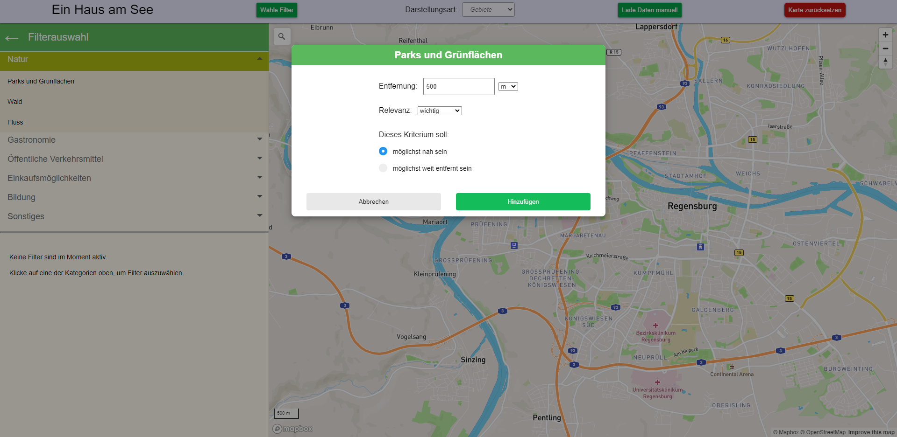

# Overview

This repository contains the code for my bachelor thesis"Ein Haus am See im Browser - Interaktives Finden von geeigneten Orten" at the University of Regensburg. The developed website shows an interactive map provided by Mapbox GL that allows the user to specify several criteria and highlights suitable regions on the map based on these preferences. The website is meant as an early tool that could be used when searching for places or areas (e.g. when moving to a new city) that fulfill certain requirements as existing websites and tools don't support this type of local search well.




Made with Mapbox GL & OpenStreetMap.

<hline>

## Requirements

The application needs a redis instance as well as the docker version of the Overpass-API running locally to work so these need to be setup before running the application. The docker version of the overpass api can be found at Dockerhub (<https://hub.docker.com/r/wiktorn/overpass-api>). For detailed instructions on how to set this up, see the instructions and examples there. The application assumes the Redis Instance is available at port 6379 and the local Overpass API runs at the port that was specified when building the docker image (something like 12345 or 12346 if you followed the examples). You can of course change this in the code (in the config.ts - File).

## Build Instructions

If the requirements are fullfilled you can run the application locally by executing the following commands in the root folder:

```
npm install
npm start
```

If everything worked well you can visit the website in your browser at <http://localhost:8000>. Note that the application uses WebGL and some other newer web technologies that may not be supported in all browsers (certainly not in IE). The application was only tested in current versions of Google Chrome and Firefox so I recommend using one of these. Some early tests suggest that it might also work as intended on current versions of Microsoft Edge and Opera.

## Demo


**At the moment the website is available at <http://pro.mi.ur.de:8000> (but this might change soon probably).**

## License

The project is licensed under the MIT License.
